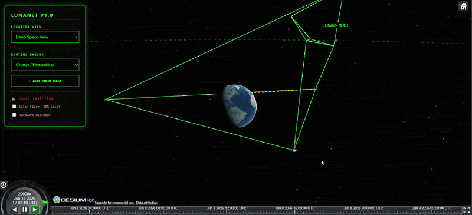

# LunaNet 3D Mission Control — Space Communications Simulator

<div align="center">

**A high-fidelity, web-native 3D Digital Twin and Delay-Tolerant Networking (DTN) simulator of the NASA LunaNet architecture.**

[](https://talha436dev.github.io/Lunanet-3D-Simulator/)
[](https://github.com/talha436dev/Lunanet-3D-Simulator)

</div>

---

> Built independently by **Syed Talha Jamal**, 6th-semester Computer Engineering student at the Sir Syed University of Engineering & Technology (SSUET), Karachi, Pakistan.  
> Developed as a self-initiated study of the NASA LunaNet Interoperability Specification and CCSDS DTN standards, with the intent of producing a research-grade, interactive tool for visualising cislunar network behaviour.

---

## Overview


*Full mission control view: 3D cislunar topology with GEO gateways, HALO/DRO orbital nodes, lunar surface base, and live DTN routing dashboard*

This simulator models the full Earth-Moon communication chain defined in the NASA LunaNet Architecture — from a terrestrial ground station in Pakistan through a GEO relay tier, across an interplanetary link, into a cislunar orbital mesh, and down to deployable surface bases with patrolling rovers. Every link is computed in real time against true planetary geometries.

Operating over the physical layer is a custom implementation of the **DTN Bundle Protocol (RFC 9171)** — the store-and-forward networking standard that NASA uses as the core framework for LunaNet. The simulator faithfully reproduces the three-tier priority system, preemptive queue eviction, and two competing routing algorithms described in the LunaNet specification.

**Standards compliance:** Architecture mapped against the NASA LunaNet Architecture Definition Document (NASA/TM–20210019864) and CCSDS Bundle Protocol Specification (RFC 9171, building on the original RFC 5050 framework).

---

## Demo


*Chaos Engineering subsystem: Solar flare packet loss injection causing link disruption and automatic rerouting*


*On-the-fly surface asset deployment: click any point on the lunar surface to instantiate a command base with 3 patrolling rovers, immediately integrated into live DTN routing*

---

## Features

### 1. Spatial Astrodynamics & Occlusion Engine

- **Planetary Ephemeris Modeling** — Tracks dynamic orbital mechanics on a 3D Cartesian grid centred on Earth at `[0, 0, 0]`. Updates the Moon's displacement vector `P(moon)` frame-by-frame using CesiumJS real-time ephemeris data.
- **Rotational Coordinate Transforms** — Applies a time-varying rotation matrix `R_z` to map the terrestrial ground station (69.34° E, 30.37° N, Pakistan) dynamically for Earth's axial spin.
- **Ray-Traced Horizon Masking** — Continuous vector cross-product calculations check for planetary obstructions using true physical radii: `R_E = 6,371 km` (Earth) and `R_M = 1,737.4 km` (Moon).
- **Lunar Polar Terrain Cutoffs** — Evaluates normalised dot-product constraints relative to the Moon's centre to sever rover-to-base links the moment a rover slips past a visible ridge, triggering automatic handover to overhead orbital relays.

### 2. Delay-Tolerant Networking (DTN) Stack

- **Store-and-Forward Bundle Caching** — Implements self-contained data blocks ("bundles") that persist in node memory vaults when physical links go dark — treating intermittent connectivity as a normal operational state, not a failure.
- **Class of Service (CoS) Prioritisation** — Three strict traffic profiles matching LunaNet specifications:
  - Priority 2 → Critical Telemetry (command-critical, never dropped)
  - Priority 1 → Standard Operational Logs
  - Priority 0 → Bulk Scientific Payloads
- **Preemptive Queue Eviction** — Bounded queue `MAX_BUFFER_CAPACITY = 5`. When a node's buffer is full, lower-priority bundles are evicted to guarantee delivery of incoming higher-priority data. Visualised live on the HUD.
- **Hop History Tracking** — Every bundle carries a full route trace from origin rover through each relay node to final delivery at the Pakistan ground station, with generation and transmission timestamps.

### 3. Hot-Swappable Routing Engines

- **Greedy Hierarchical Router** — Opportunistic engine that forwards bundles over the best immediately visible path, using a fixed priority hierarchy: Ground Station → GEO Gateways → HALO nodes → DRO satellites.
- **Contact Graph Routing (CGR)** — Schedule-aware engine that navigates predictable orbital contact windows using a pre-computed contact plan, forwarding only when a timed contact window is active and the LOS check passes. Switch between both engines live during simulation.

### 4. Network Topology

10-node Earth-Moon architecture:

```
Pakistan Ground Station (69.34°E, 30.37°N)
    │
    ├──► GEO-GATEWAY-ALPHA   (69.34°E,   35,786 km altitude)
    ├──► GEO-GATEWAY-BRAVO   (-50.66°E,  35,786 km altitude)
    └──► GEO-GATEWAY-CHARLIE (189.34°E,  35,786 km altitude)
              │  [GEO Mesh Cross-Links]
              ├──► HALO-L1     (L1 Halo Orbit,  ~35,000 km from Moon)
              ├──► HALO-L2     (L2 Halo Orbit,  ~45,000 km from Moon)
              ├──► HALO-POLAR  (Polar Orbit,     ~15,000 km from Moon)
              ├──► DRO-1       (Distant Retrograde Orbit, ~60,000 km)
              └──► DRO-2       (Distant Retrograde Orbit, ~65,000 km)
                        │
                        └──► [Deployable Lunar Surface Bases + Rovers]
```

### 5. Chaos Engineering Subsystem

- **Solar Flare Disruption** — Injects 40% random packet drop probability across all active link vectors, simulating real space weather degradation.
- **Hardware Blackout** — Completely isolates all deep-space nodes (HALO and DRO tier), severing every link to test DTN store-and-forward resilience under total relay failure.

### 6. Live Mission Control Dashboard

- Per-node buffer occupancy gauges with colour-coded saturation alerts (green → red)
- Bundle delivery analytics: packets generated / delivered / dropped with Packet Delivery Ratio (PDR)
- Full route trace for every delivered bundle: `R-1 → BASE-1 → L1 → GEO-ALPHA → GS-PAKISTAN`
- Rover telemetry readout: temperature (°C), radiation (mSv), power (%)
- Satellite status table: orbit angle, mesh link status, contact prediction

---

## Architecture

Three decoupled simulation layers:

| Layer | Responsibility | Files |
|---|---|---|
| Spatial Astrodynamics | Orbital positions, coordinate frames, WebGL rendering | `lunarSatellites.js`, `earthSatellites.js`, `groundStation.js` |
| Physical LOS | Ray-traced link state verification, occlusion masking | `lunanetNetwork.js` |
| Discrete Protocol | DTN store-and-forward, priority queues, CGR routing | `lunanetNetwork.js`, `index.html` |

```
├── welcome.html          # Splash screen & entry point
├── index.html            # Core interface: DOM, WebGL context, DTN engine, HUD
├── lunanetNetwork.js     # Protocol layer: LOS math, DTN stack, CGR, routing rules, dashboard
├── earthSatellites.js    # GEO gateway positions and orbital parameters
├── lunarSatellites.js    # Cislunar constellation orbital elements (HALO, DRO)
├── groundStation.js      # Pakistan ground station geographic coordinates
└── lunarSurface.js       # Surface base deployment, rover patrol logic, telemetry generation
```

---

## Quick Start

No compiler, bundler, or backend required. Runs entirely in the browser.

**Prerequisites:** Any modern browser with WebGL support (Chrome, Edge, Firefox, Safari).

```bash
# Clone the repository
git clone https://github.com/talha436dev/Lunanet-3D-Simulator.git

# Open welcome.html in your browser
# Recommended: VS Code + Live Server extension
```

Or open the **[Live Demo](https://talha436dev.github.io/Lunanet-3D-Simulator/)** — no installation needed.

---

## How to Use

### Viewport Navigation
- **Left-click + drag** → Rotate orbital view
- **Right-click + drag** → Pan across cislunar space
- **Scroll wheel** → Zoom into satellite paths
- **Location dropdown** → Jump camera to Deep Space / Earth / Moon views

### Deploy a Surface Base
1. Click **`+ Add Moon Base`** in the left panel
2. Move cursor over the 3D Moon and left-click any surface point
3. A command base + 3 autonomous rovers deploy instantly, link into the orbital mesh, and begin generating telemetry bundles

### Switch Routing Algorithm
Use the **Routing Engine** dropdown to toggle between Greedy and CGR modes live — watch the bundle routing paths change in real time on the dashboard.

### Stress Test the Network
- Enable **Solar Flare** → 40% packet loss injected across all links
- Enable **Hardware Blackout** → all HALO/DRO relays go dark; watch bundles queue and wait

### Read the Dashboard
- **Double-click** the Pakistan Ground Station (yellow dot) to open/close Mission Control
- Watch buffer bars fill as links drop
- Track delivered bundles with full hop-by-hop route histories and timestamps

---

## Planned Extensions 

- **Propagation Delay Modeling** — Realistic 1.3-second Earth-Moon light-speed delay with bundle queuing during blackout windows
- **Dynamic Contact Schedule Generation** — Auto-generate CGR contact plans from real ephemeris data instead of a hardcoded plan
- **NASA ION Backend Integration** — Replace JavaScript DTN queues with NASA's reference Interplanetary Overlay Network (ION) software, making this 3D viewer a front-end for actual spacecraft flight software
- **Hardware-in-the-Loop (HIL)** — STM32/ESP32 microcontrollers via WebSockets as physical DTN transceivers, validating real memory and timing constraints on embedded hardware
- **ESA Moonlight ELFO Orbit Geometries** — Add Elliptical Lunar Frozen Orbit node positions for ESA Moonlight interoperability alignment
- **Antenna Gimbal PID Tracking** — Closed-loop orientation controllers requiring real alignment before links establish

---

## Standards & References

| Document | Reference |
|---|---|
| NASA LunaNet Architecture Definition Document | NASA/TM–20210019864 |
| DTN Bundle Protocol Version 7 | RFC 9171 (IETF, 2022) |
| DTN Bundle Protocol Version 6 (original framework) | RFC 5050 (IETF, 2007) |
| CCSDS Bundle Protocol Specification | CCSDS 734.2-B-1 |
| CesiumJS Geospatial 3D Platform | cesium.com |

---

## About the Author

**Syed Talha Jamal**  
Computer Engineering Student — 6th Semester  
Sir Syed University of Engineering & Technology (SSUET), Karachi, Pakistan  

This project was built independently as a self-initiated exploration of cislunar networking standards, motivated by NASA's Artemis programme and the emerging field of interplanetary DTN. It is being extended as a Final Year Project toward research-grade simulation tools for the LunaNet and ESA Moonlight programmes.

📧 `s.talhajamal06@gmail.com`  
🔗 `www.linkedin.com/in/syed-talha-jamal-901622391`  
🌐 [Live Demo](https://talha436dev.github.io/Lunanet-3D-Simulator/)
